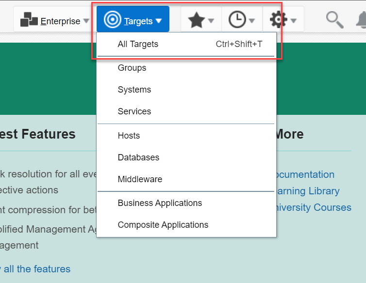
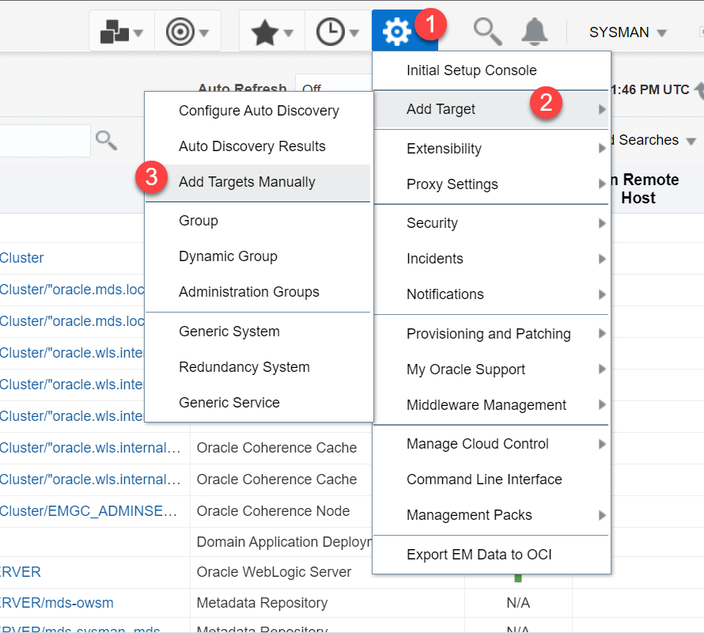
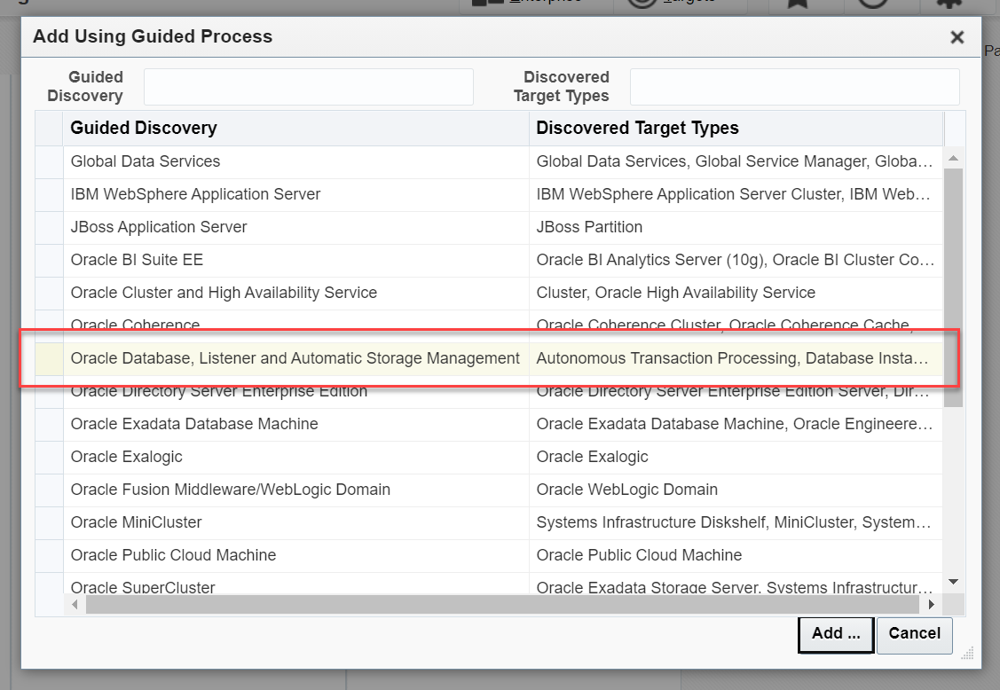
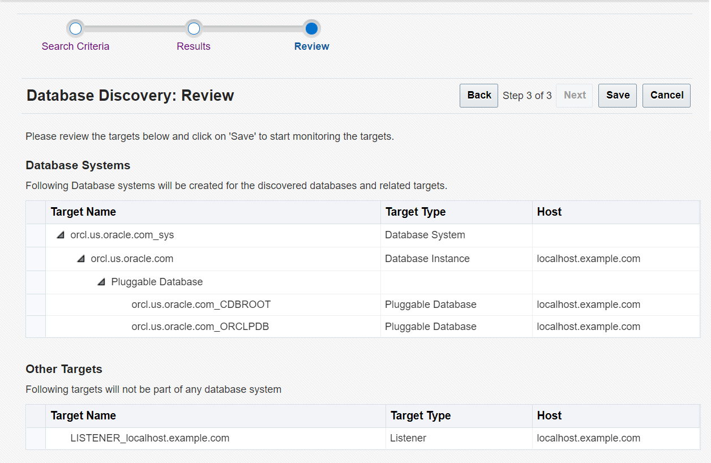
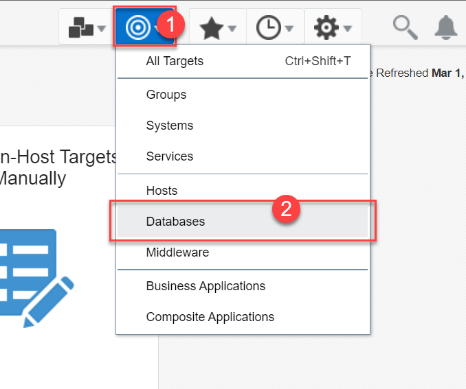
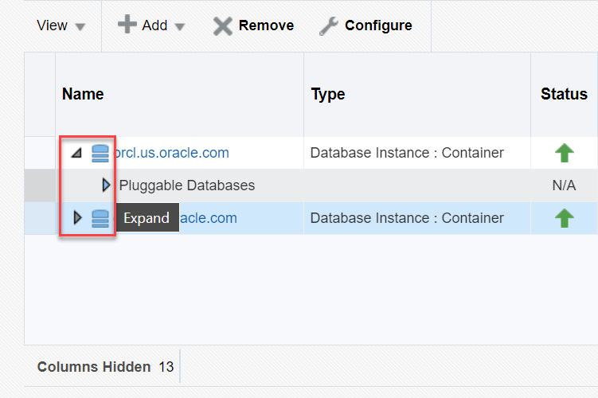
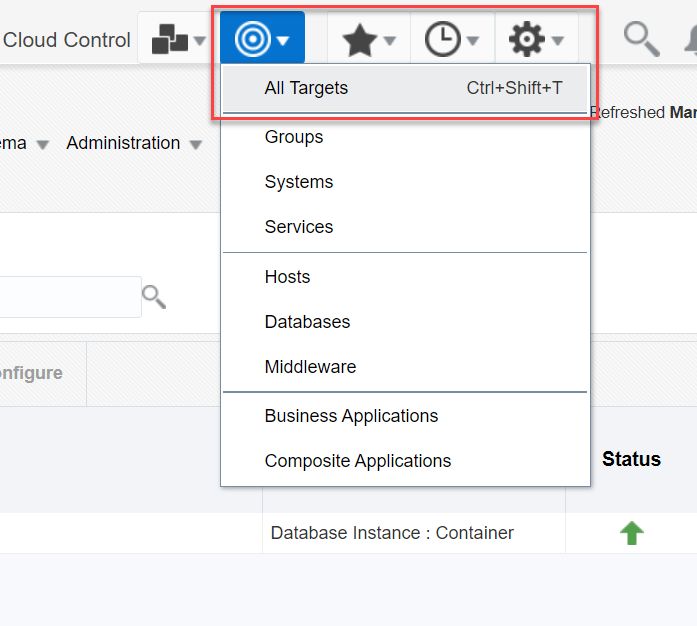

# Manage targets - Oracle Database and Listener

## Introduction

This lab shows how to manage the targets discovered by Oracle Enterprise Manager Cloud Control (EM). You can view details of Oracle Database and Listener and administer them from Oracle Enterprise Manager as managed targets.

Estimated time: 15 minutes

### Objectives

 - View existing targets in Oracle Enterprise Manager
 - Add Oracle Database and Listener as targets
 - View newly added target Oracle Database
 - Remove Oracle Database from managed targets
 - Remove Listener from managed targets

### Prerequisites

This lab assumes you have -

 -   An Oracle Cloud account
 -   Completed all previous labs successfully
 -   Logged in to Oracle Enterprise Manager in a web browser as *sysman* 

## Task 1: View targets in EM

In this task, you will view the existing targets in Oracle Enterprise Manager.

1.	From the **Targets** menu at the top, select **All Targets**.

    

	The All Targets page displays a complete list of targets discovered by Oracle Enterprise Manager, such as hosts, Oracle homes, listeners, PDBs, and so on.   
    The values may differ depending on the system you are using.  

    

1. 	Use the filters in the **Refine Search** pane on the left to view a specific target type.

    

	Click a target name to open its home page. From the target's home page, you can view the target information and manage the target.

To perform administrative tasks on your Oracle Database and Listener from Oracle Enterprise Manager, add them as targets.

## Task 2: Add Oracle Database and Listener as targets

When you add a target, such as Oracle Database or Listener, it remains in Oracle Enterprise Manager until you remove from managed targets. You can add Oracle Database and Listener as targets together in the same steps.

In this task, you will add an Oracle Database and a Listener as targets using the *guided discovery* process.

1.  From the **Setup** menu at the top, select **Add Target** &gt; **Add Targets Manually**.

    

1.  The Add Targets Manually page displays the options for adding targets.    

	For this task, under **Add Non-Host Targets Using Guided Process**, click *Add Using Guided Process* to start the discovery.

    

1.  The dialog box displays the options under Guided Discovery.

	For this task, select *Oracle Database, Listener and Automatic Storage Management*, if not already selected.

    

	Click **Add** to proceed.

    > **Note:** The Discovered Target Types for Oracle Database is 'Autonomous Transaction processing, Database instance, Listener, Pluggable database, Cluster ASM, Automatic Storage Management, Cluster Database'.

1.  Specify the host or cluster where your Oracle Database resides. Click the search icon (magnifier) to look for the target host.

    

	It opens the **Search Target** dialog box.

1.  In the **Select Targets** dialog box under the status section, locate your host system, for example *localhost.example.com*.   
    The values may differ depending on the system you are using.  

    

	Click the host name to highlight it and then click **Select** to select the host.

     > **Note:** The upward green arrow in the status indicates that the target host is up and running.

    If the window shows multiple hosts or clusters, then you can use the filters on the top to search for the target host. 

1.  Verify that the **Specify Host or Cluster** field displays the host name, for example *localhost.example.com*.    
The values may differ depending on the system you are using.  

    

	Oracle Enterprise Manager provides options to add discovery hints to customize the discovery process. For this task, ignore this field and click **Next** to proceed.   
	The window displays a progress bar indicating target discovery as EM searches for targets on your host.

1.  The Results page displays all Oracle Databases, including CDBs, PDBs, and listeners discovered on the selected host. The values may differ depending on the system you are using. 	  

    

	For this task, select one Oracle Database and one listener as targets and specify the monitoring credentials.  
     - **Target Name** - Select the check box next to Oracle Database, for example, *orcl.us.oracle.com (Container Database)*.   
     - **Role** - Select *SYSDBA*  
     The Monitoring Username changes to *sys* automatically.  
     - **Monitoring Password** - Enter the password for database administrator, for example *We!come1*  
     - **Listeners** – Select the check box for the listener, for example, *Listener_localhost.example.com*.  

    > **Note:** Oracle Enterprise Manager displays all associated PDBs discovered on your host. If you have more PDBs or CDBs, then you can manually add or remove them as targets.    
	For more information, see [Oracle Enterprise Manager documentation](https://docs.oracle.com/en/enterprise-manager/cloud-control/enterprise-manager-cloud-control/13.5/index.html).

    Leave the defaults for the remaining options and click **Next** to proceed.

1.  Review the target Oracle Database and the related listener.    
The values may differ depending on the system you are using.  

    

    Click **Save** to add the selected targets. The window displays a confirmation message.

    

	Click **Close** to close the confirmation window. EM redirects to the target discovery page.

Congratulations! You have successfully added Oracle Database and Listener as targets in EM. You can now view the targets, monitor and manage them from EM.

## Task 3: View newly added target Oracle Database

After adding Oracle Database, Oracle Enterprise Manager displays it as managed target.

In this task, you will view the newly added target Oracle Database, *orcl*, and its PDBs.

1. From the **Targets** menu, select **Databases** to open the Databases page.

	

1. The Databases page displays all discovered target database systems on your host.   
	The values may differ depending on the system you are using.

    

	Verify that the list displays *orcl*, the target Oracle Database that you added. If you have other target databases, then the page displays them all.

1.  Select a database instance name, for example *orcl.us.oracle.com*, and click **View** &gt; **Expand All Below** to view the PDBs in that container.    
	The values may differ depending on the system you are using.

    

    Alternatively, you may click the expand/collapse triangle next to the name. The list displays all PDBs under the selected database.   
	The values may differ depending on the system you are using.  

    

	The page provides two view types:
	- **Search list** - displays the databases in a list view
	- **Database Load Map** - displays the databases in a map view

You can add more Oracle Databases as targets or remove target databases from the Databases page.

## Task 4: Remove Oracle Database from managed targets

You can remove targets, such as database instances, database systems, CDBs, PDBs, and so on from EM. After removing a target, you cannot manage it from Oracle Enterprise Manager anymore. You can remove Oracle Databases or PDBs one at a time. You cannot remove multiple Oracle Databases together in a single step.

In this task, you will remove the target database instance, *orcl1*, from EM including the CDB and PDB.

> **Note:** Removing a target Oracle Database from EM does not delete or deinstall the database from the host system.

1.  On the Databases page, select the target Oracle Database that you want to remove.   
	The values may differ depending on the system you are using.

    

	For this task, select *orcl1* and click **Remove**.

1.  The window displays a warning message. The values may differ depending on the system you are using.

    

	Click **Yes** to confirm the removal.

	> Clicking **No** will cancel the delete operation and take you back to the Databases page. If you remove all target databases from EM, the Databases page displays a message `No Databases found`.

	EM redirects to the Databases page. You will notice that the Oracle Database you removed, *orcl1*, is no longer listed as a managed target.

    

You have successfully removed Oracle Database as managed targets from EM. Removing a database from EM does not remove the listener from managed targets automatically.  

## Task 5: Remove Listener from managed targets

You to remove listeners one at a time. You cannot remove multiple listeners together in a single step. In this task, you will remove the target listener, *LISTENER1*, from EM.

> **Note:** Removing a target listener from EM does not delete the listener from the host system.

1.  From the **Targets** menu, select **All Targets** to open the All Targets page.

    

1.  On the All Targets page, select the listener you want to remove.   
    The values may differ depending on the system you are using.

   

    For this task, remove the listener for `orcl1.us.oracle.com`. Right-click *LISTENER1_localhost.example.com* and select **Target Setup** &gt; **Remove Target**.

1.  The window displays a confirmation message. The values may differ depending on the system you are using.

   

	Click **Yes** to confirm the removal.

    > Clicking **No** will cancel the delete operation and take you back to the All Targets page. 

   

	Click **OK** to continue. The listener you removed is no longer listed as a managed target.

You have successfully removed the listener from managed targets in EM. When you remove a listener, EM does not delete the target Oracle Database automatically.

In this lab, you learned how to view targets in EM. You also added Oracle Database and Listener as managed targets and then removed them from managed targets. After adding targets, you can manage them from their home page.

You may now **proceed to the next lab**.

## Acknowledgments

 - **Author**: Manish Garodia, Database User Assistance Development team
 - **Contributors** - <if type="hidden">Suresh Rajan, Subhash Chandra, Steven Lemme, Ashwini R</if>
 - **Last Updated By/Date** - Manish Garodia, March 2023

<!--

	Alternatively, .

    On the Databases page, click **Add** > **Oracle Database**.

    

	With the Database Instance selected, click **Configure** to open the Database Instance Configure window.

    

	Under the **Pluggable Databases** tab, you can click **Add** to add more PDBs or click **Remove** to remove the PDBs selected for promotion and then click **Save**.

    

    

    In the load map view, you can select the **View Level** as:
    - **Database** - To display the target Oracle Databases.
    - **Instance** - To display the Database Instances.
    - **Pluggable Database** - To display the CDB and PDBs in each database.

The screenshot gives an example of removing a target CDB, *CDB$ROOT*. The values may differ depending on the system you are using.  

> **Note:** To run the labs and tasks related to EM, you require Oracle Database and the listener as managed targets in EM. If you have removed the Oracle Database and the listener from EM from the previous tasks, add them again as managed targets as explained in *Task 2* of this lab.

-->
