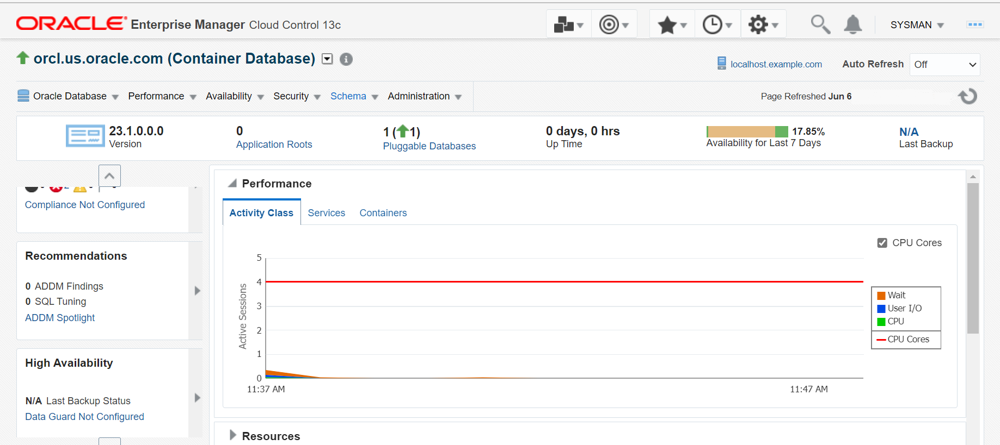
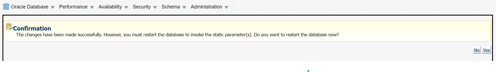
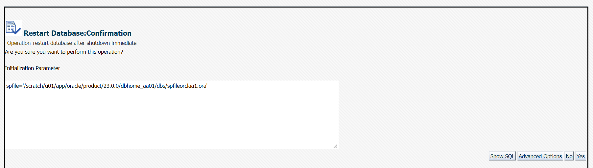

# Administer Automatic Memory Management

## Introduction

This lab shows how to enable Automatic Memory Management for Oracle Database from Oracle Enterprise Manager Cloud Control (EM) and SQL command line.

Oracle Database can manage the SGA memory and instance PGA memory. You designate only the total memory size to be used by the instance, and the database dynamically exchanges memory between the SGA and the instance PGA as needed to meet processing demands. This capability is referred to as _Automatic Memory Management_. Allowing the database instance to automatically manage and tune is one of the simplest ways to manage instance memory.

Estimated time: 15 minutes

### Objectives

-   Enable Automatic Memory Management from Oracle Enterprise Manager
-   Disable Automatic Memory Management from Oracle Enterprise Manager
-   Set environment variables 
-   Enable Automatic Memory Management from SQL Command Line

To enable Automatic Memory Management in both Oracle Enterprise Manager and SQL Command Line you require different Oracle home locations.

> **Note:** This workshop uses two Oracle homes for demonstration purpose. It is not a requirement for Oracle Database to have two homes. A single Oracle home is sufficient to install and manage a single instance multitenant container database.

### Prerequisites

This lab assumes you have -

-   An Oracle Cloud account
-   Completed all the previous labs successfully

## Task 1: Enable Automatic Memory Management from Oracle Enterprise Manager

After logging in to EM, you can view the status of Automatic Memory Management and enable it.

1.  From the **Targets** menu, select **Databases**.
    
    The Databases page displays a list of Oracle Databases added to EM as managed targets.  
    The values may differ depending on the system you are using.  
      
      
2.  Click the database instance name, _orcl.us.oracle.com__,_ to open the instance home page.  
    The values may differ depending on the system you are using.
      
      
3.  From the **Performance** menu, select **Advisors Home**.
      
      
4.  On the Advisors tab, select **Memory Advisors**.
      
      
    > **Note:** The Memory Advisors option is available only from the database instance home page, and not from the PDB home page. You can use Memory Advisors when the Automatic Memory Management feature is disabled. The Memory Advisors automatically adjusts the memory distribution among the various SGA and PGA for optimal performance. These adjustments are made within the boundaries of your total SGA and PGA target values. If the Memory Advisor finds that the current amount of available memory is inadequate and adversely affecting performance, it recommends you to increase your SGA or PGA target value. You can set new values for the SGA and PGA using the Memory Advisor. 
    
    If the **Maximum SGA Size (MB)** field consists of a positive number that is greater than or equal to the total amount of memory to allocate to the database, then you can directly **Enable** Automatic Memory Management option without performing rest of the steps.  
      
5.  In the **Maximum SGA Size (MB)** field, enter the maximum permissible size for database memory and click **Apply**. For this lab the Maximum SGA Size entered is _6 GB_.
      
      
    > **Note:** To decide the maximum SGA size, use the sum of the current sizes of the SGA and instance PGA as a guideline, and optionally add some extra values for extension.  
      
6.  A confirmation page appears indicating that you must restart Oracle Database. Click **Yes** to restart the database.
    
    
    The Restart Database page appears which displays Host and Target Database Credentials.
!   [Restart Database Credentials](../administer-auto-memory-management/images/restartdb_namedcred)  
         
7.  For Host Credentials, specify the following.
    
    **Credential**: _Named_  
    Oracle Enterprise Manager fills in the **UserName** and **Password** fields automatically.  
    You can click **More Details** and then click **Test** to verify that the specified host credentials are working.  
      
8.  For Database credentials, specify the following.
    
    **Credential**: _Preferred_.  
    **Preferred Credential Name**: _SYSDBA Database Credentials_. This is the credential you assigned during Oracle Database installation.
    
    Click **OK** to proceed.  
      
9.  A window appears to confirm restarting the database. Click **Yes** to restart the database. 
    
    Oracle Database takes a while to restart. After which you receive an update message of successful database restart.   
    
10.  Click **Refresh** to return to the Database home page.  
    
    Now, go to the Memory Advisors page and view the status of Automatic Memory Management as follows.  
      
11.  On the Database home page, click the database instance name, *orcl.us.oracle.com*, to open the instance home page.  
      
      
12.  From the **Performance** menu, select **Advisors Home**.  
      
      
13.  In the Advisors section, select **Memory Advisors**.  
      
      
14.  The Memory Advisors page displays the status of Automatic Memory Management as Disabled. Click **Enable** to enable this option.  
       
    
15.  On the Enable Automatic Memory Management page, in the Total Memory Size for Automatic Memory Management field, enter the required amount of memory to allocate to the database and then click **OK**. For this lab, 5 GB is used as Total Memory Size for Automatic Memory Management.  
      
      
    The window displays a message to confirm that you have enabled Automatic Memory Management. Oracle Database will automatically adjust the memory sizes to achieve optimal distribution.   
      
    You can verify that you have enabled the Automatic Memory Management option for your Oracle Database. From the instance home page, go to Memory Advisors as explained in this task earlier. The Automatic Memory Management option displays \*Enabled\*.  
    
    
## Task 2: Disable Automatic Memory Management from Oracle Enterprise Manager

From Memory Advisors home page in EM, you can disable Automatic Memory Management for your Oracle Database and manage the memory sizes manually.

1.  Click **Disable** next to the Automatic Memory Management option.
    
    
    You have disabled Automatic Memory Management for your Oracle Database from EM. The Memory Advisors page displays **Disabled** next to the Automatic Memory Management option.
    
    
You can now log out of Oracle Enterprise Manager.
    
## Task 3: Set environment variables

> **Note:** From Task 3 you will use the other Oracle home location. This workshop uses two Oracle homes for demonstration purpose. It is not a requirement for Oracle Database to have two homes. A single Oracle home is sufficient to install and manage a single instance multitenant container database.

To connect to your Oracle Database, you must set the environment variables from a terminal. These variables remain in the terminal until you close the terminal.

> **Note:** The environment variables set in one terminal do not apply automatically to the other terminals you may have. If you open a new terminal or have a terminal window already open, then you must set these variables in that terminal to connect to Oracle Database.

In this task, you will set the following environment variables for your Oracle Database.

-   _`$ORACLE_SID`_
-   _`$ORACLE_HOME`_
-   _`$ORACLE_BASE`_

1.  Open a terminal window and go to the `bin` directory in Oracle home.  
    ```
    $ <copy> cd /u01/app/oracle/product/23.0.0/dbhome_2/bin </copy>
    ```

2.  Run the command `oraenv` to set the environment variables.  
    ```
    $ <copy> . oraenv </copy>
    ```
    
3.  When prompted for $ORACLE_SID, enter *orcl1*.  

    ```
    ORACLE_SID = [oracle] ? <copy> orcl1</copy>   
    The Oracle base has been set to /u01/app/oracle
    ```  

    > **Note:** Oracle SID is case sensitive. This command sets the variables *$ORACLE\_SID* and *$ORACLE\_BASE* also sets the *$ORACLE_HOME* path to `/u01/app/oracle/product/23.0.0/dbhome_2`.
    
You have set the environment variables for Oracle Database in the active terminal session. You can now connect to Oracle Database and run the SQL commands.

**Tip:** If you have reserved a Livelabs sandbox environment, then you can run the script . set-env-db.sh from the home location and enter the corresponding number for the ORACLE_SID. It sets the environment variables automatically.

## Task 4: Enable Automatic Memory Management from SQL command line

1.  From `$ORACLE_HOME/bin`, log in to SQL command line as `SYSDBA`.  
    ```
    $ <copy> ./sqlplus / as sysdba </copy>
    ```
    ```
    SQL\*Plus: Release 23.0.0.0.0 - Production on Tue May 30 11:16:16 2023  
    Version 23.1.0.0.0
    
    Copyright (c) 1982, 2023, Oracle. All rights reserved.
    
    Connected to:  
    Oracle Database 23c Enterprise Edition Release 23.0.0.0.0 - Production  
    Version 23.1.0.0.0
    
    SQL>
    ```
    
2.  View the values of all initialization parameters with the string `TARGET` in the parameter name.
    ```
    SQL> <copy> show parameter target</copy>
    ```
    It displays the following output.
    ```
    NAME                                     TYPE           VALUE  
    ------------------------------------     -----------    ------------------------------  
    archive_lag_target                       integer        0  
    db_big_table_cache_percent_target        string         0  
    db_flashback_retention_target            integer        1440  
    fast_start_io_target                     integer        0  
    fast_start_mttr_target                   integer        0  
    memory_max_target                        big integer    0  
    memory_target                            big integer    0  
    parallel_servers_target                  integer        80  
    pga_aggregate_target                     big integer    3167M  
    sga_target                               big integer    9504M  
    target_pdbs                              integer        18
    
    NAME                                      TYPE         VALUE  
    ------------------------------------      -----------  ------------------------------  
    txn_auto_rollback_high_priority_wait      integer      2147483647  
    _target  
    txn_auto_rollback_medium_priority_wa      integer      2147483647  
    it_target
    ```
    
    Run the following commands and change the values of the initialization parameters.  
      
    
3.  Set the parameter `memory_max_target` to _6G_.  
    ```
    SQL> <copy> alter system set memory_max_target=6G scope=spfile;</copy>
    ```
    ```
    System altered.
    ```

4.  Set the parameter `memory_target` to _5G_.  
    ```
    SQL> <copy> alter system set memory_target=5G scope=spfile;</copy>
    ```
    ```
    System altered.
    ```

5.  Set the parameter `pga_aggregate_target` to _0_.  
    ```
    SQL> <copy> alter system set pga_aggregate_target=0 scope=spfile;</copy>
    ```
    ```
    System altered.
    ```

6.  Set the parameter `sga_target` to _0_.  

    ```
    SQL> <copy> alter system set sga_target=0 scope=spfile;</copy>
    ```
    ```
    System altered.
    ```

    > **Note:** The preceding steps instruct you to set the parameters `SGA_TARGET` and `PGA_AGGREGATE_TARGET` to _0_ so that the size of the SGA and instance PGA are tuned up and down as required, without restrictions.
    
    For the new values of the parameters to take effect, shut down and start the database instance.  
      
7.  Shut down the database instance in _IMMEDIATE_ mode.   
    ```
    SQL> <copy> shutdown immediate;</copy>
    ```
    ```
    Database closed.
    
    Database dismounted.
    
    ORACLE instance shut down.
    ```

8.  Start the database instance again and open Oracle Database.  
    ```
    SQL><copy> startup</copy>
    ```
    ```
    ORACLE instance started.
    
    Total System Global Area 9951006048 bytes  
    Fixed Size                 10038624 bytes  
    Variable Size            1543503872 bytes  
    Database Buffers         8388608000 bytes  
    Redo Buffers                8855552 bytes  
    Database mounted.  
    Database opened.
    ```
    The database instance starts in the default _OPEN_ mode.  
      
9.  Execute `show parameter target` command to view the new values of the initialization parameters.  
    ```
    SQL> <copy> show parameter target</copy>
    ```  
    ```
    NAME                                 TYPE        VALUE
    ------------------------------------ ----------- -------
    archive_lag_target                   integer     0
    db_big_table_cache_percent_target    string      0
    db_flashback_retention_target        integer     1440
    fast_start_io_target                 integer     0
    fast_start_mttr_target               integer     0
    memory_max_target                    big integer 6G
    memory_target                        big integer 5G
    parallel_servers_target              integer     80
    pga_aggregate_target                 big integer 0
    sga_target                           big integer 0
    target_pdbs                          integer     12

    NAME                                    TYPE        VALUE   
    ------------------------------------    ----------- ------------------------------   
    txn_auto_rollback_high_priority_wait    integer     2147483647   
    _target   
    txn_auto_rollback_medium_priority_wa    integer     2147483647   
    it_target   
    ```
    
    To verify if the Automatic Memory Management has been Enabled, log in to Oracle Enterprise Manager in a web browser and navigate to Advisors Home. The Memory Advisors page shows Automatic Memory Management as Enabled.  

Congratulations! You have successfully completed the workshop on _Database Instance and Memory Management_.

## Acknowledgments

-   **Author** - Aayushi Arora, Database User Assistance Development Team
-   **Contributors** - Manish Garodia, Jayaprakash Subramanian, Ashwini R
-   **Last Updated By/Date** - Aayushi Arora, July 2023

