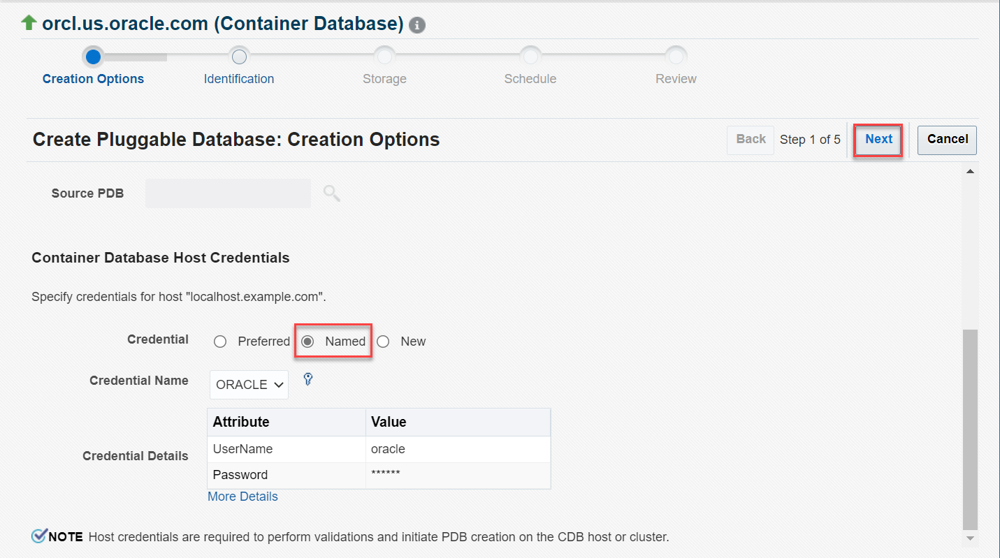

# Plug PDBs into CDB

## Introduction

This lab shows how to create a new Pluggable Database (PDB) in a Container Database (CDB) by plugging in an unplugged PDB from Oracle Enterprise Manager Cloud Control (EM).

Estimated time: 15 minutes

### Objectives

Perform these tasks from Oracle Enterprise Manager:
 -   Plug an unplugged PDB into the root container
 -   View the newly created PDB

### Prerequisites

This lab assumes you have -

 -   An Oracle Cloud account
 -   Completed all previous labs successfully
 -   Logged in to Oracle Enterprise Manager in a web browser as *sysman*

> **Note:** This lab contains many system-specific values. Such details might vary depending on the system you are using.

## Task 1: Plug an unplugged PDB into the root container

Before plugging in the PDB, ensure that you have a PDB that is unplugged. You can plug the unplugged PDB into the same or another container.

In this task, you will plug the unplugged PDB, namely *PDB2*, into another root container, *ocrl1*, and create a new PDB, namely *PDB3*, in your Oracle Database.

You can open the Databases page from the menu **Targets** &gt; **Databases**.

1.  On the Database pages, click the Database Instance name, for example *orcl.us.oracle.com*, to open the instance home page.

	 

    The green upward arrow in the **Status** field indicates that the database instance is up and running.

	

1.  From the **Oracle Database** menu on the instance home page, select **Provisioning** &gt; **Provision Pluggable Databases**.

	 

1.  The Provision Pluggable Databases Console opens and displays the options for various PDB operations.  
    Scroll down and select **Create New Pluggable Databases**.

	 

    Click **Launch** to start the PDB plug operation.

	

	 

1.  On the PDB Creation page, select the option *Plug an Unplugged PDB*.   
    This option creates a new PDB using an unplugged PDB.

	 

    The PDB Creation page has other options also for creating a PDB. For this task, leave the other options.

	

1.  Scroll down the page. Under **Container Database Host Credentials**, select the *Named* Credential option, if not already selected.

	 

	 

    Click **Next** to proceed.

1.  On the Identification page, note that a PDB name is automatically assigned.

	 

    For this lab, specify the following:

     - **PDB Name** - Delete the default text and enter a unique name for the PDB you are plugging. For this task, enter *PDB3*.

		 

     - **Create as Clone** - Select this check box.   
    This option ensures that Oracle Database generates a unique DBID, GUID, and other identifiers for the new PDB.

     - **Create Multiple Copies** - Do not select this check box and create only one PDB in the database.   
    You can create up to *252* PDBs in a CDB.

1.  Select the **Create PDB Administrator** option to create a new administrative user account for the PDB.   
    If you want to use the administrative user account of the source PDB, then do not select this option.

	 

    Enter the login credentials for the new administrative user.
    - **Username** - *PDB3ADMIN*
    - **Password** - Set a password, for example, *mypassword*   
	Ensure to note the password because you will require it when you log in to the PDB as *PDB3ADMIN*.

	 

	Oracle Enterprise Manager provides a check box **Lock All Existing PDB Users** to lock and expire all users in the newly created PDB, except the PDB administrator. For this lab, do not select this check box.

1.  Scroll down the page. In the PDB Template Location section, select the location of the source PDB template and the type of template.

    You can select from the following options:

     - **Target Host File System** - to select the PDB Template from the CDB host where you are plugging in the unplugged PDB.
	 - **Create the PDB from PDB Archive** - to plug the PDB using the archive (TAR) file with data files and the metadata XML file.
     - **Create the PDB using PDB File Set** - to plug the PDB using the DFB file with all data files and the metadata XML file.
     - **Create PDB using Metadata file** - to plug the PDB using the PDB metadata XML file and the existing data files.
     - **Software Library** - to specify the component in Oracle Software Library that contains the PDB template.

    For this lab, the page displays the default options *Target Host File System* and *Create the PDB from PDB Archive* selected. Use these options because you unplugged the PDB in the previous lab with the same options.

	For creating the PDB, you must select **PDB Archive Location**. Click the magnifier icon next to this field to browse the PDB template file.

     > **Note:** Though you can type the template file name and location in this field, Oracle recommends that you use the file browser.

	 

    The file browser window displays the files and templates associated with the PDBs.

1.  Select the PDB template, *PDB2.tar.gz*, in the file browser window.

	 

    This window supports single select, which means you can select only one PDB template.

    Under the **Properties** column, click **Show** to view the details of the selected PDB template.

	 

    Click **OK** to close the properties window. Click **OK** again on the file browser window. The window goes back to the Identification page.

1.  Verify that the **PDB Archive Location** field displays the PDB template you selected.

	 

    Click **Next** to proceed.

	Oracle Enterprise Manager performs validation for PDB identification and the metadata, such as the disk space, the file validity, the administrative user, and so on. On successful validation, Oracle Enterprise Manager goes to the PDB storage options.

1.  You can select storage options for the PDB, such as the storage type, location to store data files and temporary files, and so on.

	 

    For this lab, leave the default storage options.

	 

	 

    Click **Next** to proceed.

1.  Oracle Enterprise Manager takes a while to validate and prompts to schedule the plug operation.

	 

    Specify the following:

     - **Deployment Instance** - Delete the default text and enter a unique name, *plug pdb2*.  
		

		 > **Note:** If the instance name already exists, then Oracle Enterprise Manager returns a validation error. You cannot create procedures in EM with duplicate names.

     - **Start** - Leave the default, *Immediately*, to run the procedure now.

	

    Click **Next** to proceed.

1.  The Review page displays a summary of the PDB plug operation. For example, the container database name, the PDB name which you entered, the host details, the storage options, and so on.

	 

    Verify the following on this page:
     - **PDB Creation Options** - *PDB Archive*
     - **PDB Archive** - *full path and location of the file system*
     - **Storage type** - *File System*

    Review the details and click **Submit** to start plugging the PDB into the root container.

1.  Oracle Enterprise Manager displays a confirmation window.

	 

    Click **View Execution Details** to open the Procedure Activity page and view the status of the procedure.

     > **Note:** If you click **OK**, then Oracle Enterprise Manager goes to the Provision Pluggable Databases page.

    The Procedure Activity page contains the detailed steps of the PDB create operation. After the PDB is created, the **Status** field changes from *Running* to *Succeeded*.

	 

	

You have created *PDB3* by plugging in an unplugged PDB into the another CDB. The PDB is open in `Read/Write` mode. You can view this PDB in Oracle Enterprise Manager displayed under the database instance.

## Task 2: View the newly created PDB

After plugging in the PDB, you can check that Oracle Database displays the newly created PDB.

In this task, you will view the new PDB, namely *PDB3*, in your database.

1.  From the **Targets** menu, select **Databases** to open the Databases page.

	 

1.  Click the expand/collapse triangle next to the instance name, for example *orcl.us.oracle.com*, where you created the PDB.

	 

    The Databases page displays the new PDB, *PDB3*, in the database instance along with the existing PDB, *ORCL1PDB*. The green upward arrows in the **Status** field indicate that the database instance and the PDBs are up and running.

In this lab, you learned how to plug an unplugged PDB into another root container. Similarly, you can plug PDBs into a remote container.

You may now **proceed to the next lab**.

## Acknowledgments

 -   **Author**: Manish Garodia, Database User Assistance Development team
 -   **Contributors**: <if type="hidden">Suresh Rajan, Ashwini R, Jayaprakash Subramanian</if>
 -   **Last Updated By/Date**: Manish Garodia, August 2023
