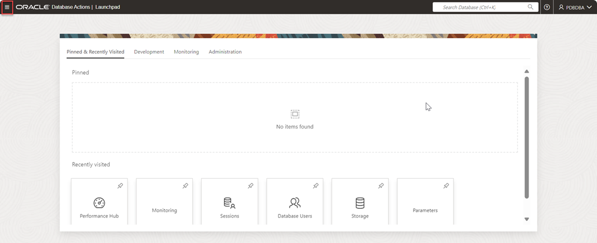
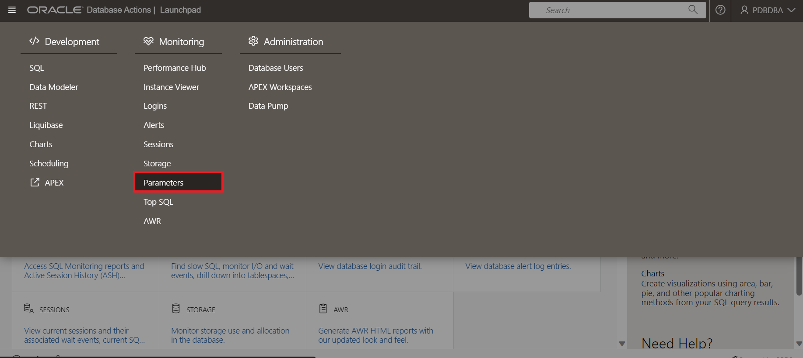
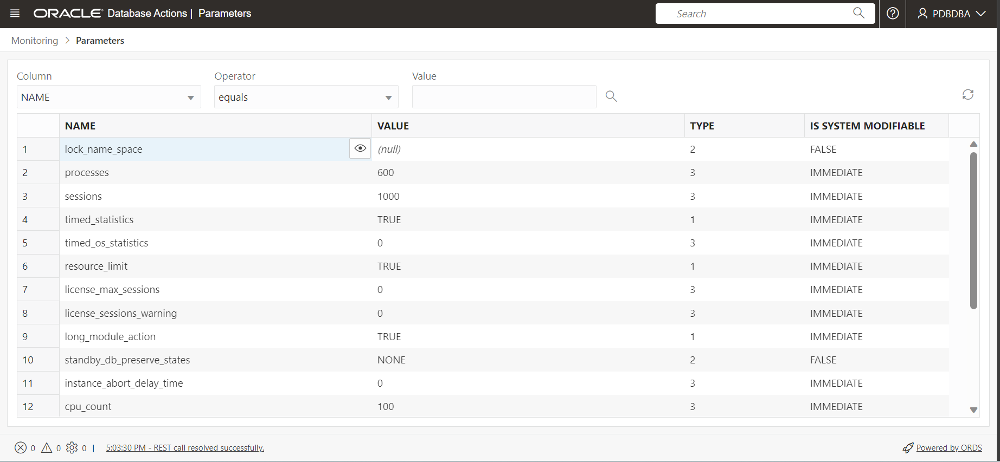

# View and Manage Initialization Parameters

## Introduction

The Oracle Database Actions tab walks you through the steps to view initialization parameters in Oracle Database Actions to specify the properties of the Database Instance. 

The Oracle Enterprise Manager tab will guide you through the steps of managing initialization parameters in Oracle Enterprise Manager Cloud Control (EM). You can view and modify the initialization parameters to specify the properties of the database instance.

Estimated time: 15 minutes

### Objectives  
Manage and view the initialization parameters of the database instance using Oracle DBA and EM.
  
### Prerequisites

This lab assumes you have -

For Oracle Database Actions lab:

-   ORDS installed and configured
-   *HR* schema enabled to access Database Actions
-   Log in to Database Actions in a web browser as PDBDBA

For Oracle Enterprise Manager lab:

-   An Oracle Cloud account
-   Completed all the previous labs successfully

<if type="dba">

## Task 1: View initialization parameters

1.  From the Launchpad, click **Selector** Icon on the upper left corner.   
      
      
2.  Under Monitoring section, click **Parameters**.  
      
    You can view the Parameters page which displays the initialization parameters.   
     

3.  You can view the following information about the initialization parameters:  
    **Name:** The name of the initialization parameter.  
    **Value:** The value of the initialization parameter.  
    **Type:** The value indicates the type of initialization parameter. Following are the values with their data types:  
      
    1 -Boolean  
    2 -String  
    3 -Integer  
    4- Parameter file  
    5- Reserved  
    6- Big Integer  
      
    **Is System Modifiable:** Displays if the initialization parameter can be changed with an ALTER SESSION command.   
      
    The parameters page includes a search filter.  
      
4.  In this task, to search *processes*, you will, select **NAME** in the Column drop-down list, **equals** in the Operator drop-down list, and in the  value field enter **processes**. 
    Click the search icon for the result.  
      
      
    You can view the *processes parameter in the search output*.

5.  Click Refresh  icon periodically to update the data.

Congratulations! You have successfully completed the workshop on *View Database Instance and Memory for Oracle Database 23ai* using Oracle Database Actions.

## Acknowledgements 

-   **Author** - Aayushi Arora, Database User Assistance Development Team
-   **Contributors** - Jeff Smith, Manisha Mati
-   **Last Updated By/Date** - Aayushi Arora, September 2024
</if>

<if type="emcc">

## Task 1: View and modify Initialization Parameters

To view and modify the values of the initialization parameters, log in to EM and perform the following steps. 

For this lab, view the initialization parameter `processes` and modify the values for the parameters `open_cursors` and `processes`.

1.  From the **Targets** menu, select **Databases**.
    
    The Databases page displays a list of Oracle Databases added to EM as managed targets.  
    The values may differ depending on the system you are using.
      
    
2.  Click on the database instance name, *orcl.us.oracle.com*, to open the instance home page.  
    The values may differ depending on the system you are using.
      
    
3.  From the **Administration** menu, select **Initialization Parameters**.
    
    The Database login screen appears.  
    
4.  Click on Named Credential. This option fills the credential details automatically.  
    The values may differ depending on the system you are using.
      
    Click **Login** to proceed.
     

    The Initialization Parameters window has two tabs:

    -   **Current** — This default tab displays all initialization parameter values that are currently active and in memory for the database instance.
    -   **SPFile** — This tab displays initialization parameter settings in the server parameter file (SPFILE). The window displays the SPFile tab if the database instance starts with the SPFile. But if the database instance starts with the PFile, the window does not display this tab.
    
    > **Note:** If the **Value** field for a parameter is not editable, it means that the parameter is not dynamic. You cannot change that parameter for the current instance.  
    
5.  Click the **SPFile** tab to view parameters in the server parameter file.
    
    The window displays the initialization parameters of the container database.  
    The values may differ depending on the system you are using.

    > **Note:** The server parameter file is a binary file that can be written to and read by Oracle Database and is the recommended format for the initialization parameter file.  
    
6.  On the **SPFile** tab, view the parameter `processes` by performing the following steps.
    
    -   **Name**: *processes*
        Enter the full name of the parameter. The **Name** field is case-sensitive.
    -   **Basic**: Select **Yes** to limit the display to basic initialization parameters.
    -   **Dynamic**: Select **Yes** to limit the display to dynamic initialization parameters.  
        You could select any category of initialization parameters from the **Category** dropdown to limit the search to that particular category.
    
    Click **Go**.
    
    The window displays the value of the parameter `processes`. Similarly, you can view the values of other initialization parameters.  
      
7.  Click the **Current** tab. In the **Name** field, enter the full name of the parameter *open_cursors*. Leave the defaults for the other fields and click **Go** to search for the parameter.
      
    
8.  Set the value for the parameter `open_cursors` to, for example, *350*.  
    > **Note:** If you set `open_cursors` too high, you could run out of memory.  
      
    The **Comments** field is optional. You may enter a text explaining the reason for the change.
    
    > **Note:** Ensure that the **Apply changes in current running instance(s) mode to SPFile** option is not selected. Select this option only to modify the initialization parameter for the currently running instance and record the modifications in the server parameter file before the database restarts.
    
    Click **Apply**. A confirmation message appears. The **Current** tab displays the updated value of `open_cursors`.
      
    
9.  Click the **SPFile** tab. In the **Name** field, enter the full name of the parameter _processes_. Leave the defaults for the other fields and click **Go** to search for the parameter.
      
      
10.  Set the value of the parameter `processes` to, for example, *300*.  
    The **Comments** field is optional. You may enter a text explaining the reason for the change.

> **Note:** Ensure that the **Apply changes in SPFile mode to the current running instance(s)** option is not selected. Select this option only to modify the initialization parameter for the currently running instance and record the modifications in the server parameter file before the database restarts.

Click **Apply**. A confirmation message appears. The **SPFile** tab displays the updated value of 'processes'.

Similarly, you can view and modify the initialization parameters of the Container Database (CDB) and Pluggable Database (PDB) by switching between containers from the database instance home page.

In a PDB, the Initialization Parameters page includes the PDB Modifiable column. Each initialization parameter that can be modified at the PDB level has a check mark in the PDB Modifiable column.

> **Note:** Any initialization parameter in a PDB that does not have a check mark in the PDB Modifiable column can be set and modified only in the root. The value set in the root applies to the individual PDBs in the multitenant CDB.

Initialization parameters exist at both the CDB level and the PDB level. By default, initialization parameters at the PDB level inherit the value from the initialization parameters at the CDB level. 

You may now **proceed to the next lab.**

## Acknowledgments

-   **Author** - Aayushi Arora, Database User Assistance Development Team
-   **Contributors** - Manish Garodia, Jayaprakash Subramanian, Ashwini R
-   **Last Updated By/Date** - Aayushi Arora, May 2024
</if>